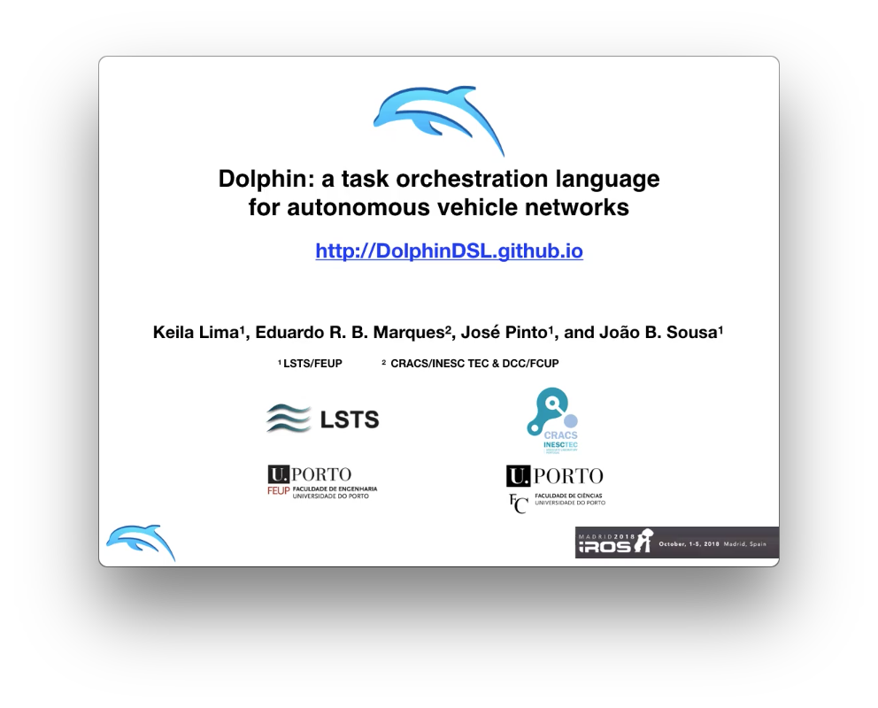

# Dolphin

Dolphin is a task orchestration language for autonomous vehicle networks.
A Dolphin program expresses an orchestrated execution of tasks defined compositionally for multiple vehicles.  Building upon the base case of elementary one-vehicle tasks, the built-in operators include support for composing tasks in several forms, for instance according to concurrent, sequential, or event-based task flow. 

The language is implemented as a [Groovy DSL](http://groovy-lang.org), facilitating extension and integration with external software packages, in particular robotic toolkits.  We have done so for the [LSTS toolchain](http://github.com/LSTS) and work torwards support for the [MAVLink](http://mavlink.io/en) drone protocol is in progress.

## Publications
 
* Keila Lima, Eduardo R. B. Marques, José Pinto, João B. Sousa,
[Dolphin: A task orchestration language for autonomous vehicle networks](docs/iros2018_submission.pdf), [IROS'18](http://www.iros2018.org)
  * [IROS'18 companion video (extended version)](docs/iros2018_submission.mp4) - click the image below. 

* Keila Lima, Eduardo R. B. Marques, José Pinto, João B. Sousa,
[Programming networked vehicle systems using Dolphin - Field tests at REP'17](docs/oceans18.pdf), [IEEE/MTS Oceans'18](http://www.oceans18mtsieeekobe.org). This is a short paper describing field tests we conducted during [REP'17](http://rep17.lsts.pt).

* Keila Lima, [Dolphin: A domain-specific language for autonomous vehicle networks](https://repositorio-aberto.up.pt/bitstream/10216/110607/2/250115.pdf), 
MSc Thesis, MIERSI/DCC/FCUP, 2017, supervised by Eduardo R. B. Marques
and José Pinto

## Team

* [Keila Lima](https://www.researchgate.net/profile/Keila_Lima), [LSTS/FEUP](http://www.lsts.pt), previously a MSc student 
at [DCC/FCUP](http://www.dcc.fc.up.pt).
* [Eduardo R. B. Marques](http://www.dcc.fc.up.pt/~edrdo), [DCC/FCUP](http://www.dcc.fc.up.pt) and [CRACS/INESC-TEC](http://cracs.fc.up.pt)
* [José Pinto](http://zepinto.info), [LSTS/FEUP](http://www.lsts.pt)
* João B. Sousa, [LSTS/FEUP](http://www.lsts.pt) 

